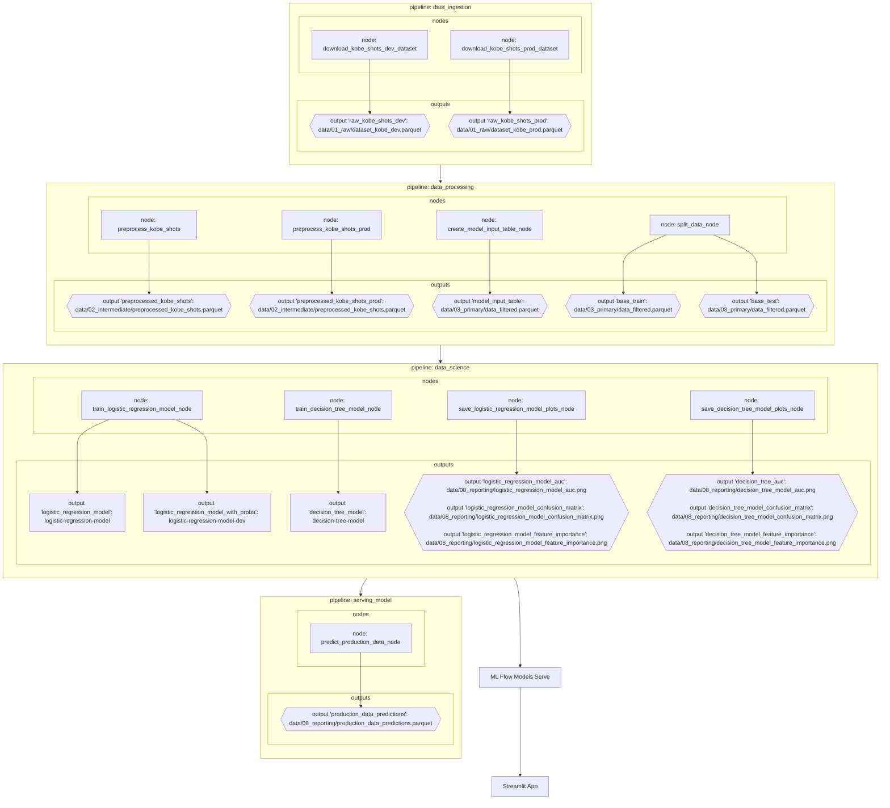

Projeto de machine learning com o objetivo de prever se Kobe Bryant acertou ou errou uma tentativa de arremesso, utilizando abordagens de classificação e regressão. O projeto é baseado no dataset [Kobe Bryant Shot Selection](https://www.kaggle.com/c/kobe-bryant-shot-selection/overview), disponível no Kaggle.

Perfeito! Aqui está um exemplo bem organizado da seção de Instalação e Execução para o seu README.md, seguindo suas instruções:

Link do repositório:

```
https://github.com/thealexandrelara/project-infnet-engenharia-de-machine-learning
```

# Rúbricas do projeto

Para facilitar a avaliação, desenvolvi uma documentação estruturada com base nas rúbricas do projeto, contendo explicações detalhadas de como cada critério foi atendido ao longo do desenvolvimento:

Link: https://github.com/thealexandrelara/project-infnet-engenharia-de-machine-learning/blob/main/docs/rubricas.md

⸻

# Instalação e Execução do Projeto

Este projeto foi desenvolvido em Python 3.10 e utiliza as bibliotecas Kedro, kedro-mlflow, PyCaret, MLflow, e Streamlit. Para facilitar a gestão de dependências e o ambiente virtual, é recomendado o uso do `uv`.

## Pré-requisitos

    • Python 3.10 instalado
    • uv instalado (instruções para instalação podem ser encontradas (aqui)[https://docs.astral.sh/uv/getting-started/installation/#installing-uv])

#### Instalação do projeto

Clone o repositório e instale as dependências:

```bash
git clone https://github.com/thealexandrelara/project-infnet-engenharia-de-machine-learning
```

```
cd project-infnet-engenharia-de-machine-learning
```

#### Instale as dependências listadas em pyproject.toml

```bash
uv add -r requirements.txt
```

#### Instale o Kedro como ferramenta para fazer uso do CLI

```bash
uv tool install kedro
```

⸻

# Execução dos Pipelines

Este projeto está organizado em pipelines modulares do Kedro, e utiliza o kedro-mlflow para registrar os experimentos corretamente. Por isso, as pipelines **devem ser executadas individualmente** para garantir que o nome de cada run no MLflow seja registrado de forma apropriada.

Pipelines no projeto:

1. Coleta de Dados:

```bash
kedro run --pipeline data_ingestion
```

2. Processamento de Dados:

```bash
kedro run --pipeline data_processing
```

3. Treinamento do Modelo:

```bash
kedro run --pipeline data_science
```

4. Pipeline de execução do modelo previamente treinado:

```bash
kedro run --pipeline model_serving
```

⸻

#### Servindo o Modelo com MLflow

Após o treinamento, você pode servir o modelo com o MLflow diretamente da interface local:

```bash
mlflow models serve -m models:/logistic-regression-model/latest -p 5001
```

Dessa forma, você tem acesso a http://127.0.0.1:5001/invocations para inferências via API REST. Esta etapa é obrigatória para o funcionamento adequado do Streamlit.

⸻

Interface com Streamlit

Com o modelo já sendo servido, você pode rodar a interface para inferência com Streamlit:

```bash
streamlit run streamlit/app.py
```

A aplicação irá consumir o modelo via API exposta pelo MLflow.

⸻

Estrutura do Projeto

```
├── conf/                         - pasta contendo configurações do kedro e mlflow
├── data/                         - pasta onde os outputs de cada nó são salvos
├── docs/                         - pasta com tudo relacionado a documentação
├── notebooks/                - pasta com os jupyter notebooks utilizados para exploração e testes
├── src/                           - pasta com o código fonte das pipelines e nós
├── streamlit/                  - aplicação Streamlit para inferência do modelo
│ └── app.py
├── README.md           - documentação principal do projeto
├── pyproject.toml
└── requirements.txt
```

⸻

# Diagrama

Abaixo encontra-se o diagrama contendo todas as etapas necessárias para este projeto que vai desde a pipeline de aquisição até a operação do modelo. Caso deseje olhar as pipelines separadamente e em alta resolução, pode-se encontrar as imagens na pasta [/docs](https://github.com/thealexandrelara/project-infnet-engenharia-de-machine-learning/tree/main/docs) do repositório.



### Como as ferramentas Streamlit, MLflow, PyCaret e Scikit-Learn auxiliam na construção dos pipelines?

Rastreamento de Experimentos (Experiment Tracking)

- MLflow é utilizado para na etapa de rastreamento dos experimentos, registrando hiperparâmetros, métricas (no caso deste projeto log_loss e f1_score são métricas sendo registradas), artefatos (como o modelo treinado, plots), versões das dependências, etc.
- A integração do kedro-mlflow foi utilizada no projeto facilitando o processo de registro dos experimentos por meio da execução das pipelines.

Funções de Treinamento

- PyCaret é uma ferramenta de AutoML que simplifica a criação, comparação, tuning e validação de múltiplos modelos de classificação.
- O PyCaret tem o Scikit-Learn como dependência que auxilia na parte do treinamento, preparação dos dados, pré e pós-processamento.
- Neste projeto, o PyCaret foi utilizado para separação de treino e teste (nos bastidores é utilizado o Scikit-learn) e também para a parte de treinamento do modelo, assim como obtenção das métricas que foram posteriormente salvas no MLFlow.

Monitoramento da Saúde do Modelo

- O monitoramento da saúde do modelo pode ser feito por meio da análise de Data Drift, Feature Drift e Concept Drift. Essas mudanças são identificadas através de comparações estatísticas entre dados históricos e novos dados e pelo monitoramento contínuo das métricas de performance.
- Atualmente, estamos registrando as métricas utilizando o MLFlow, então a cada versão do modelo treinado podemos realizar a comparação dessas métricas. Caso a gente queira fazer uma análise mais detalhada de drift, precisaríamos fazer a coleta e armazenamento dos dados para podermos aplicar por exemplo testes de Kolmogorov-Smirnov ou Qui-quadrado.

Atualização de Modelo

- Ao rodar a pipeline `data_science` ocorre o treinamento do modelo e o armazenamento de uma nova versão do modelo treinado no MLFlow Model Registry.
- Uma vez disponibilizada a nova versão pelo MLFlow, podemos servir este modelo com `mlflow models serve -m models:/logistic-regression-model/latest -p 5001`
- Com o Streamlit podemos consumir o modelo. Como estamos passando `latest` ao servir o modelo, garantimos que sempre estaremos consumindo o último modelo disponível.

Provisionamento (Deployment)

- O modelo é versionado e registrado no MLflow Model Registry.
- Pode ser servido via API local com mlflow models serve ou embarcado diretamente na aplicação Streamlit, garantindo inferência direta.
- A interface desenvolvida em Streamlit permite interação com o modelo, visualização dos dados e resultados das previsões.

## Artefatos

### Camada raw

Dados recebidos diretamente da fonte (Github API), sem qualquer tipo de tratamento ou pré-processamento. A pipeline utilizada foi `data_ingestion`.

raw_kobe_shots_dev

    Objetivo: Dataset de desenvolvimento contendo os dados históricos de arremessos do Kobe Bryant utilizados para treinamento e validação do modelo.
    - Formato: .parquet
    - Localização: data/01_raw/dataset_kobe_dev.parquet
    - Colunas:
        - action_type: tipo específico do arremesso ([categórica nominal] ex: Jump Shot, Layup).
        - combined_shot_type: tipo genérico do arremesso ([categórica nominal] ex: Jump Shot).
        - game_event_id: identificador do evento do jogo ([numérica discreta] ex: 10, 12).
        - game_id: identificador único do jogo ([numérica discreta] ex: 20000012).
        - lat, lng: coordenadas geográficas da tentativa ([numérica contínua] ex: 33.9723, -118.1028).
        - loc_x, loc_y: coordenadas cartesianas da tentativa ([numérica contínua] ex: 33.9723, -118.1028).
        - minutes_remaining, seconds_remaining: tempo restante no período ([numérica discreta] ex: 2, 12).
        - period: número do período ([numérica discreta] ex: 1 a 4, ou prorrogações).
        - playoffs: flag indicando se é jogo de playoff ([categórica binária] ex: 0 temporada regular, 1 para playoffs).
        - season: temporada ([categórica ordinal] ex: 2010-11).
        - shot_distance: distância do arremesso ao cesto ([numérica discreta] ex: 30, 55).
        - shot_made_flag: variável-alvo ([categórica binária] ex: 1 para acerto, 0 para erro).
        - shot_type: Tipo de arremesso ([categórica nominal] ex: 2PT ou 3PT)
        - shot_zone_area: Área lateral da quadra ([categórica nominal]ex: Right Side, Left Side)
        - shot_zone_basic: Tipo de região ([categórica nominal] ex: Mid-Range, Restricted Area, etc)
        - shot_zone_range: Faixa de distância ([categórica ordinal] ex: Less Than 8 ft., 8-16 ft., 16-24 ft., etc)
        - team_id: Identificador do time ([categórica nominal] ex: Los Angeles Lakers)
        - team_name: identificadores do time ([categórica nominal] ex: 1610612747).
        - game_date: data do jogo ([temporal] ex: 2000-10-31).
        - matchup: descrição do confronto ([categórica nominal] ex: LAL vs BOS).
        - opponent: time adversário ([categórica nominal] ex: POR).
        - shot_id: identificador único do arremesso ([numérica discreta] ex: 12).

raw_kobe_shots_prod

    Objetivo: Dataset de produção contendo dados diferentes em relação ao dataset utilizado no treino. Será utilizado para aplicar o modelo de produção e fazer análise da aderência dessa base ao modelo treinado.
    - Formato: .parquet
    - Localização: data/01_raw/dataset_kobe_prod.parquet
    - Colunas: Mesmo schema do raw_kobe_shots_dev.

#### Camada intermediate – Dados pré-processados

Conjunto de dados que passaram por etapas de limpeza, transformação e codificação, mas ainda não estão preparados para o treino final do modelo.

preprocessed_kobe_shots

    Descrição: Dados de desenvolvimento após o pré-processamento inicial (ex: renomear colunas, etc).
    - Objetivo: Servirá como base para geração da tabela de entrada do modelo. Alterei o nome da coluna `lon` para `lng` para atender o especificado no projeto.
    - Formato: .parquet
    - Localização: data/02_intermediate/preprocessed_kobe_shots.parquet
    - Colunas:
        - action_type: tipo específico do arremesso ([categórica nominal] ex: Jump Shot, Layup).
        - combined_shot_type: tipo genérico do arremesso ([categórica nominal] ex: Jump Shot).
        - game_event_id: identificador do evento do jogo ([numérica discreta] ex: 10, 12).
        - game_id: identificador único do jogo ([numérica discreta] ex: 20000012).
        - lat, lng: coordenadas geográficas da tentativa ([numérica contínua] ex: 33.9723, -118.1028).
        - loc_x, loc_y: coordenadas cartesianas da tentativa ([numérica contínua] ex: 33.9723, -118.1028).
        - minutes_remaining, seconds_remaining: tempo restante no período ([numérica discreta] ex: 2, 12).
        - period: número do período ([numérica discreta] ex: 1 a 4, ou prorrogações).
        - playoffs: flag indicando se é jogo de playoff ([categórica binária] ex: 0 temporada regular, 1 para playoffs).
        - season: temporada ([categórica ordinal] ex: 2010-11).
        - shot_distance: distância do arremesso ao cesto ([numérica discreta] ex: 30, 55).
        - shot_made_flag: variável-alvo ([categórica binária] ex: 1 para acerto, 0 para erro).
        - shot_type: Tipo de arremesso ([categórica nominal] ex: 2PT ou 3PT)
        - shot_zone_area: Área lateral da quadra ([categórica nominal]ex: Right Side, Left Side)
        - shot_zone_basic: Tipo de região ([categórica nominal] ex: Mid-Range, Restricted Area, etc)
        - shot_zone_range: Faixa de distância ([categórica ordinal] ex: Less Than 8 ft., 8-16 ft., 16-24 ft., etc)
        - team_id: Identificador do time ([categórica nominal] ex: Los Angeles Lakers)
        - team_name: identificadores do time ([categórica nominal] ex: 1610612747).
        - game_date: data do jogo ([temporal] ex: 2000-10-31).
        - matchup: descrição do confronto ([categórica nominal] ex: LAL vs BOS).
        - opponent: time adversário ([categórica nominal] ex: POR).
        - shot_id: identificador único do arremesso ([numérica discreta] ex: 12).

preprocessed_kobe_shots_prod

    - Descrição: Versão de produção dos dados pré-processados, com as mesmas transformações aplicadas ao dataset de desenvolvimento. A ideia é facilitar a sua utilização com o modelo treinado.
    - Finalidade: Alimentar o modelo final em ambiente de aplicação.
    - Formato: .parquet
    - Localização: data/02_intermediate/preprocessed_kobe_shots_prod.parquet
    - Colunas: mesmo esquema do `preprocessed_kobe_shots`

#### Camada primary

Dados já organizados com as features selecionadas, normalizadas e estruturadas para alimentar os algoritmos de ML.

model_input_table

    - Descrição: Tabela final com todas as features tratadas, utilizada para separação em treino/teste. Representa o input consolidado para os modelos.
    - Formato: .parquet
    - Localização: data/03_primary/data_filtered.parquet
    - Dimensão: 20285 registros (linhas) e 7 colunas
    - Colunas:
        - lat, lng: coordenadas geográficas da tentativa ([numérica contínua] ex: 33.9723, -118.1028).
        - minutes_remaining, seconds_remaining: tempo restante no período ([numérica discreta] ex: 2, 12).
        - period: número do período ([numérica discreta] ex: 1 a 4, ou prorrogações).
        - playoffs: flag indicando se é jogo de playoff ([categórica binária] ex: 0 temporada regular, 1 para playoffs).
        - shot_distance: distância do arremesso ao cesto ([numérica discreta] ex: 30, 55).
        - shot_made_flag: variável-alvo ([categórica binária] ex: 1 para acerto, 0 para erro).

base_train

    - Descrição: Subconjunto da model_input_table contendo os dados utilizados para o treinamento do modelo.
    - Finalidade: Treinar modelos de machine learning com PyCaret.
    - Formato: .parquet
    - Localização: data/03_primary/base_train.parquet
    - Colunas: mesmo schema da `model_input_table` descrita acima.

base_test

    - Descrição: Subconjunto da model_input_table contendo os dados utilizados para a avaliação do modelo.
    - Finalidade: Calcular métricas como log_loss e f1_score durante o experimento.
    - Formato: .parquet
    - Localização: data/03_primary/base_test.parquet
    - Colunas: mesmo schema da `model_input_table` descrita acima.

#### Artefatos no MLFlow

Modelos treinados e salvos com MLflow, prontos para uso em produção ou experimentação. Inclui versões com e sem probabilidades, além dos registros no MLflow Model Registry.

logistic_regression_model

    - Descrição: Modelo de regressão logística treinado com scikit-learn, salvo via MLflow para rastreamento. Trata-se do modelo escolhido para fazer a predição de arremessos.
    - Uso: Versão padrão para predições com .predict().
    - Registro no MLflow: logistic-regression-model

logistic_regression_model_with_proba

    - Descrição: Mesmo modelo da regressão logística, mas configurado para retornar probabilidades com .predict_proba() que é utilizado para cálculo do log_loss.
    - Registro no MLflow: logistic-regression-model-dev

logistic_regression_model_dev

    - Descrição: Acesso ao modelo de regressão logística com .predict_proba() registrada no MLflow Model Registry como logistic-regression-model-dev.

decision_tree_model

    - Descrição: Modelo de árvore de decisão treinado e salvo via MLflow.
    - Registro no MLflow: decision-tree-model

#### Camada reporting

Artefatos visuais gerados para análise dos modelos, como AUC, matriz de confusão e importância das variáveis.

logistic_regression_model_auc

    - Descrição: Gráfico de curva ROC AUC do modelo de regressão logística.
    - Localização: data/08_reporting/logistic_regression_model_auc.png

logistic_regression_model_confusion_matrix

    - Descrição: Matriz de confusão com desempenho do modelo.
    - Localização: data/08_reporting/logistic_regression_model_confusion_matrix.png

logistic_regression_model_feature_importance

    - Descrição: Gráfico de importância das features no modelo.
    - Localização: data/08_reporting/logistic_regression_model_feature_importance.png

decision_tree_model_auc

    - Descrição: Gráfico de curva ROC AUC da árvore de decisão.
    - Localização: data/08_reporting/decision_tree_model_auc.png

decision_tree_model_confusion_matrix

    - Descrição: Matriz de confusão da árvore de decisão.
    - Localização: data/08_reporting/decision_tree_model_confusion_matrix.png

decision_tree_model_feature_importance

    - Descrição: Gráfico de importância das features da árvore.
    - Localização: data/08_reporting/decision_tree_model_feature_importance.png

production_data_predictions

    - Descrição: Dataset contendo os resultados das previsões feitas com os dados de produção. Inclui os valores reais (y_true), as predições (y_pred), e as métricas de avaliação (log_loss e f1_score) aplicadas ao modelo carregado via MLflow.
    - Composição:
        - y_true: Classe real do alvo nos dados de produção.
        - y_pred: Classe prevista pelo modelo.
        - model_log_loss: Valor da função de custo log_loss calculado com predict_proba.
        - model_f1_score: F1 Score das predições classificadas com .predict().
        - Finalidade: Auxilia na avaliação da aderência do modelo ao novo conjunto de dados e no monitoramento da performance.
        - Formato: .parquet
        - Localização: data/08_reporting/production_data_predictions.parquet

---

## Importância da separação treino e teste

Os dados foram divididos em dois conjuntos, sendo 80% para treino e 20% para teste. Foi utilizado uma divisão estratificada e aleatória garantindo que a proporção das classes (shot_made_flag) seja mantida em ambos os conjuntos.

Esta etapa é essencial para avaliar o desempenho real do modelo. O conjunto de treino é usado para ajustar os parâmetros do modelo, enquanto o conjunto de teste permite avaliar sua generalização em dados nunca vistos.

Estratégias para reduzir viés de dados:

- Estratificação: Garante representatividade balanceada das classes nos conjuntos.
- Cross-validation: O treino do modelo ocorreu usando cross-validation para testar o modelo em múltiplas partições, reduzindo o risco de overfitting ou viés de amostragem.
- Shuffling aleatório: Foi utilizado um shuffling para introduzir aleatoriedade e evitar que a ordem original influenciasse no modelo.

## Escolha do modelo

O modelo selecionado foi a Regressão Logística. Foi possível observar um melhor desempenho na métrica de log_loss, além de uma melhor curva ROC e mais verdadeiros positivos na matriz de confusão. Também vale destacar a maior simplicidade e interpretabilidade do modelo de regressão logística.

## Aderência do modelo à base de produção

Ao realizar a inferência na base de produção, o desempenho caiu consideravelmente, o que indica que ele não é aderente à base de produção. A base de produção contém somente tentativas de arremessos de 3 pontos, enquanto a base de desenvolvimento tem tentativa de arremessos de 2 pontos. Analisando a feature importance, temos a seguinte ordem de maior para menor importância no modelo: lat, lng e shot_distance.

Considerando isso, dá pra notar que são variáveis relacionadas com o posicionamento na quadra e distância do arremesso, ou seja, como a base tem um contexto diferente (o posicionamento na quadra para cestas de 2 e 3 pontos são diferentes), ela não consegue generalizar para a base de produção (que não foi utilizada durante o treinamento).

## Monitoramento de saúde do modelo com e sem a disponibilidade da variável resposta

No caso de termos a variável resposta, podemos fazer o monitoramento periódico do desempenho por meio das próprias métricas log_loss, F1 Score, Precision, Recall, etc., e dessa forma detectar rapidamente a degradação do modelo. Podemos criar um dashboard de desempenho ou formas de receber alertas quando as métricas caírem abaixo de valores aceitáveis.

Se a variável resposta não está disponível, podemos adotar diferentes estratégias de monitoramento como da distribuição de mudanças na distribuição dos dados de entrada (data drift), aplicar testes estatísticos como Kolmogorov-Smirnov, monitorar as saídas do modelo (concept drift), etc.

## Estratégias de retreinamento

Estratégia Reativa

- Com base no monitoramento do modelo em produção, pode ser que seja detectada uma degradação no modelo e com base nisso seja necessário um retreinamento, por exemplo, degradação de alguma métrica ou se houver algum desvio estatístico nas variáveis de entrada. O retreino ocorre após a detecção do problema.

Estratégia Preditiva

- Periodicamente ocorre o retreino do modelo, podendo incluir dados de fontes diferentes, dados simulados, dados que foram rotulados posterior ao modelo anterior, isso contribui pra manter o modelo atualizado. Se ocorrer uma detecção de drift, também pode ser feito o retreino. O retreino ocorre por antecipação.
