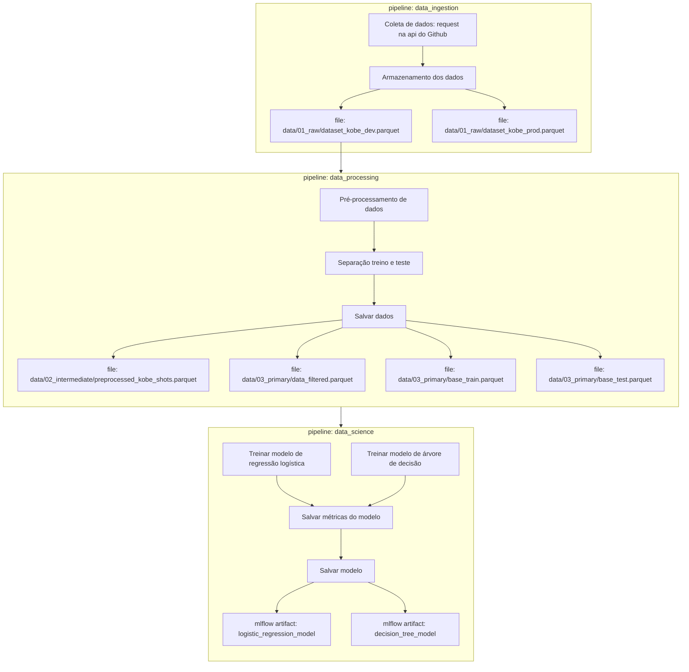

Projeto de machine learning com o objetivo de prever se Kobe Bryant acertou ou errou uma tentativa de arremesso, utilizando abordagens de classificação e regressão. O projeto é baseado no dataset [Kobe Bryant Shot Selectio](https://www.kaggle.com/c/kobe-bryant-shot-selection/overview), disponível no Kaggle.

### Como as ferramentas Streamlit, MLflow, PyCaret e Scikit-Learn auxiliam na construção dos pipelines?

🧪 Rastreamento de Experimentos (Experiment Tracking)

- MLflow é utilizado para rastrear cada execução (run) dos experimentos, registrando hiperparâmetros, métricas (como log_loss e f1_score), artefatos (como o modelo treinado) e versões dos dados e código utilizados.
- O Kedro facilita a integração desses experimentos em pipelines reprodutíveis e versionados.

⚙️ Funções de Treinamento

- PyCaret simplifica a criação, comparação, tuning e validação de múltiplos modelos de classificação com poucas linhas de código.
- Scikit-Learn é utilizado nos bastidores do PyCaret e também diretamente para etapas de pré-processamento personalizadas ou no pós-processamento.
- As funções de treinamento são integradas ao pipeline do Kedro, que garante modularidade e organização.

📈 Monitoramento da Saúde do Modelo

- Utilizamos MLflow para registrar métricas de desempenho que ajudam a monitorar a saúde do modelo ao longo do tempo.
- Em produção, a saúde pode ser acompanhada via métricas como log_loss, f1_score, proporção de classes previstas, entre outras, comparadas com as dos dados de treino.

🔁 Atualização de Modelo

- O pipeline foi estruturado para permitir reexecuções programadas ou sob demanda (reativo ou preditivo).
- Alterações no conjunto de dados de produção podem ser detectadas com data drift e model drift, sinalizando a necessidade de retreinamento.
- O modelo pode ser atualizado automaticamente com novos dados rotulados, com logs completos sendo mantidos pelo MLflow.

🚀 Provisionamento (Deployment)

- O modelo é versionado e registrado no MLflow Model Registry.
- Pode ser servido via API local com mlflow models serve ou embarcado diretamente na aplicação Streamlit, garantindo inferência direta.
- A interface desenvolvida em Streamlit permite interação com o modelo, visualização dos dados e resultados das previsões.
