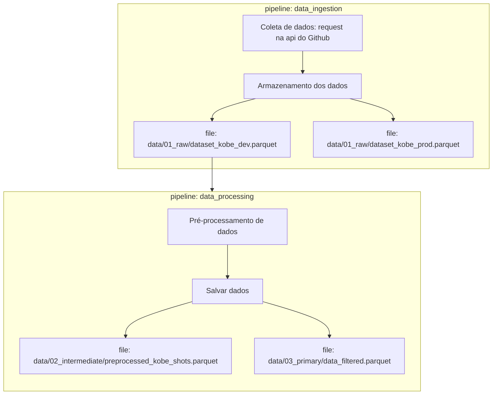

Projeto de machine learning com o objetivo de prever se Kobe Bryant acertou ou errou uma tentativa de arremesso, utilizando abordagens de classificação e regressão. O projeto é baseado no dataset [Kobe Bryant Shot Selectio](https://www.kaggle.com/c/kobe-bryant-shot-selection/overview), disponível no Kaggle.

