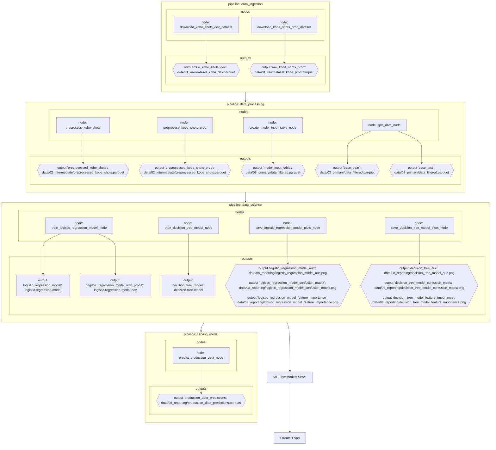

Projeto de machine learning com o objetivo de prever se Kobe Bryant acertou ou errou uma tentativa de arremesso, utilizando abordagens de classificação e regressão. O projeto é baseado no dataset [Kobe Bryant Shot Selectio](https://www.kaggle.com/c/kobe-bryant-shot-selection/overview), disponível no Kaggle.

# Diagrama

Abaixo encontra-se o diagrama contendo todas as etapas necessárias para este projeto que vai desde a pipeline de aquisição até a operação do modelo:

### Como as ferramentas Streamlit, MLflow, PyCaret e Scikit-Learn auxiliam na construção dos pipelines?

Rastreamento de Experimentos (Experiment Tracking)

- MLflow é utilizado para na etapa de rastreamento dos experimentos, registrando hiperparâmetros, métricas (no caso deste projeto log_loss e f1_score são métricas sendo registradas), artefatos (como o modelo treinado, plots), versões das dependências, etc.
- A integração do kedro-mlflow foi utilizada no projeto facilitando o processo de registro dos experimentos por meio da execução das pipelines.

Funções de Treinamento

- PyCaret é uma ferramenta de AutoML que simplifica a criação, comparação, tuning e validação de múltiplos modelos de classificação.
- O PyCaret tem o Scikit-Learn como dependência que auxilia na parte do treinamento, preparação dos dados, pré e pós-processamento.
- Neste projeto, o PyCaret foi utilizado para separação de treino e teste (nos bastidores é utilizado o Scikit-learn) e também para a parte de treinamento do modelo, assim como obtenção das métricas que foram posteriormente salvas no MLFlow.

Monitoramento da Saúde do Modelo

- O monitoramento da saúde do modelo pode ser feito por meio da análise de Data Drift, Feature Drift e Concept Drift. Essas mudanças são identificadas através de comparações estatísticas entre dados históricos e novos () e pelo monitoramento contínuo das métricas de performance.
- Atualmente, estamos registrando as métricas utilizando o MLFlow, então a cada versão do modelo treinado podemos realizar a comparação dessas métricas. Caso a gente queira fazer uma análise mais detalhada de drift, precisaríamos fazer a coleta e armazenamento dos dados para podermos aplicar por exemplo testes de Kolmogorov-Smirnov ou Qui-quadrado.

Atualização de Modelo

- Ao rodar a pipeline `data_science` ocorre o treinamento do modelo e o armazenamento de uma nova versão do modelo treinado no MLFlow Model Registry.
- Uma vez disponibilizada a nova versão pelo MLFlow, podemos servir este modelo com `mlflow models serve -m models:/logistic-regression-model/latest -p 5001`
- Com o Streamlit podemos consumir o modelo. Como estamos passando `latest` ao servir o modelo, garantimos que sempre estaremos consumindo o último modelo disponível.

Provisionamento (Deployment)

- O modelo é versionado e registrado no MLflow Model Registry.
- Pode ser servido via API local com mlflow models serve ou embarcado diretamente na aplicação Streamlit, garantindo inferência direta.
- A interface desenvolvida em Streamlit permite interação com o modelo, visualização dos dados e resultados das previsões.
